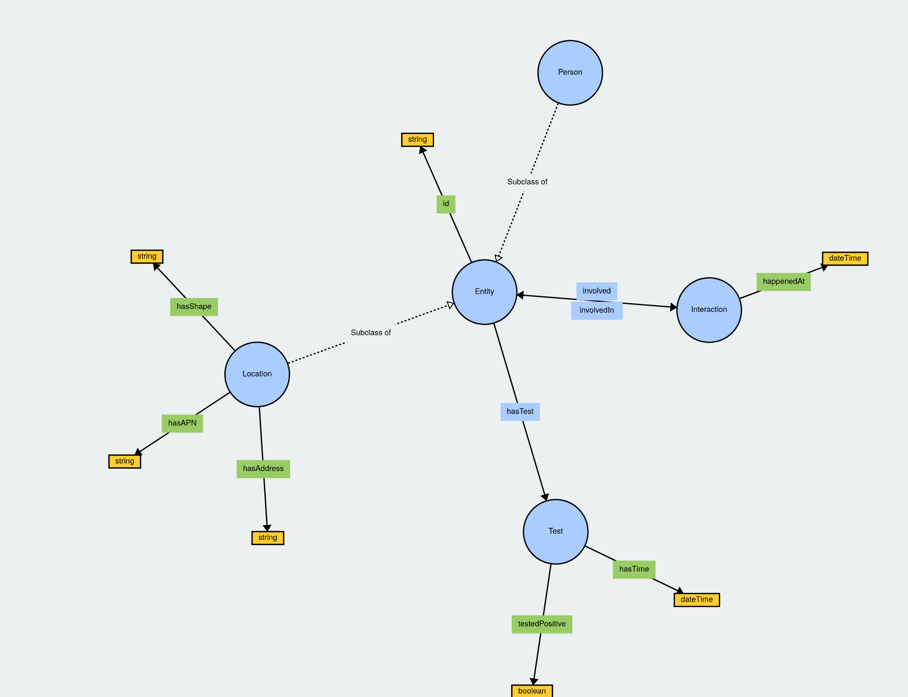

# Data Model / Ontology

Prototype of ontology for interaction-based model

- `ontology.ttl`: formal OWL definition
- `example.ttl`: example usage
- `example.py`: Python file for showing how to query/integrate the ontology

TODO:
- integrate with a real database
- explore using SHACL to mandate data properties
